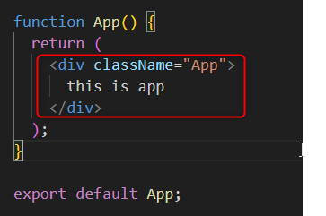
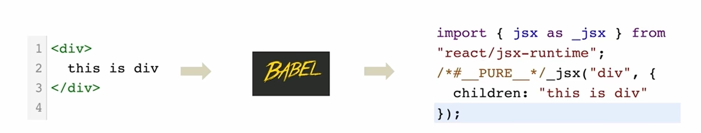
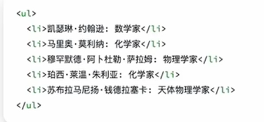

# 1

## 1-使用create-react-app快速搭建开发环境

执行命令：

```bash
npx create-react-app react-basic

# 1.npx Node.js工具命令

# 2.create-react-app 核心包，用于创建React项目

# 3.react-basic 项目名称(可自定义)

```
## 2-界面启动

```bash
npm start

```

### 2.1-react功能介绍

1. package.json dependencies

```json
  "dependencies": {
    "@testing-library/jest-dom": "^5.17.0",
    "@testing-library/react": "^13.4.0",
    "@testing-library/user-event": "^13.5.0",
    "react": "^18.2.0",
    "react-dom": "^18.2.0",
    "react-scripts": "5.0.1",
    "web-vitals": "^2.1.4"
  },
```

dependencies里面放了核心的包，最重要的两个是
"react": "^18.2.0",
"react-dom": "^18.2.0",
2. package.json scripts

```json
"scripts": {
    "start": "react-scripts start",
    "build": "react-scripts build",
    "test": "react-scripts test",
    "eject": "react-scripts eject"
  },
```
scripts放了启动的命令
start是启动的命令
build是打包的命令

3. 核心目录src

最核心的两个文件

index.js和App.js

index.js是一切的入口

```javascript
//把app根组件渲染到id为root的dom节点上
const root = ReactDOM.createRoot(document.getElementById('root'));
root.render(
  <App />
);
```

根组件的页面在/public/index.html中

4. app.js是根组件

```javascript
//根组件

function App() {
  return (
    <div className="App">
      this is app
    </div>
  );
}

export default App;
```

整个项目的调用流程是：

app.js根组件被引入到index.js中，然后通过index.js被渲染到index.html中

## 3-jsx

JSX是javascript和xml(html)的缩写，表示在**JS代码中编写HTML模板结构**，它是React中编写UI模板的方式



return里就说jsx

优势
1. HTML的声明式模板写法

2. JS的可编程能力

### 3.1-JSX的本质

JSX并不是标准的JS语法，它是**JS的语法拓展**，浏览器本身并不能识别，需要通过**解析工具解析**之后才能在浏览器中运行




### 3.2-高频场景

JSX中使用JS表达式

在JSX中可以通过大括号语法{}识别JavaScript中的表达式，比如常见的变量、函数调用、方法调用等等

1. 使用引号传递字符串
```javascript
function App() {
  return (
    <div className="App">
      this is app
      {"Hello,React"}
    </div>
  );
}

export default App;
```
2. 使用JavaScript变量
```javascript
//根组件
const Count = 100
function App() {
  return (
    <div className="App">
      this is app
      {/* {识别js变量} */}
      {Count}
    </div>
  );
}

export default App;
```
3. 函数调用和方法调用
```javascript
//根组件
function getName(){
  return 'jack'
}
function App() {
  return (
    <div className="App">
      this is app
      {/* {传递函数} */}
      {getName()}
    </div>
  );
}

export default App;
```

```javascript
//根组件
function App() {
  return (
    <div className="App">
      this is app
      {/* {调用方法} */}
      {new Date().getDate()}
    </div>
  );
}

export default App;
```
4. 使用JavaScript对象


```javascript
//根组件

function App() {
  return (
    <div className="App">
      this is app
      {/* {调用js对象} */}
      <div
      style={{color:'red'}}>
        this is a div
      </div>
    </div>
  );
}

export default App;
```

### 3.3-JSX中实现列表渲染



